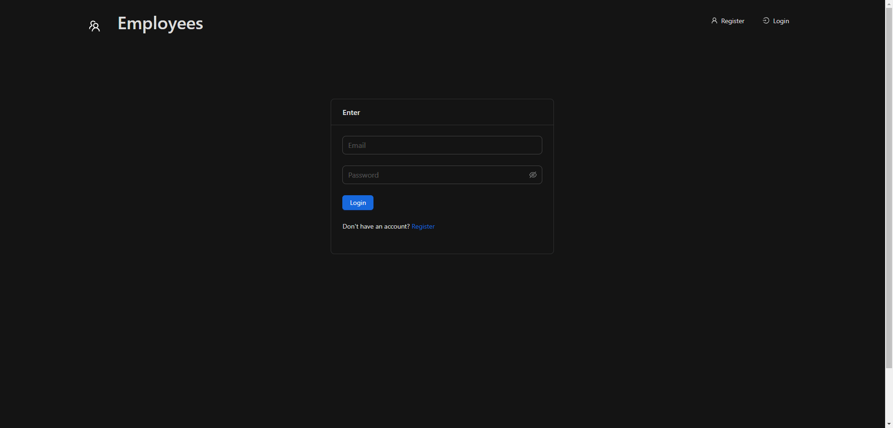

<div id="top"></div>

<!-- PROJECT LOGO -->
<br />
<div align="center">

<h3 align="center">React Employees</h3>

  <p align="center">
    <a href="https://github.com/Freekson/React-Employees/issues">Report Bug</a>

  </p>
</div>

<!-- TABLE OF CONTENTS -->
<details>
  <summary>Table of Contents</summary>
  <ol>
   <li>
      <a href="#about-the-project">About The Project</a>
    </li>
    <li><a href="#stack">Stack</a></li>  
    <li><a href="#preview">Preview</a></li> 
    <li><a href="#instalation">Installation</a></li>
    <li><a href="#contact">Contact</a></li>
  </ol>
</details>

<!-- ABOUT THE PROJECT -->

# About The Project

### Welcome to the React Employees!

Сutting-edge web application that streamlines employee management for your business. Built using the latest web technologies including Express, TypeScript, React, and Prisma, React-Employees offers a comprehensive suite of features to simplify your workforce management process.

### Key Features

**User Authentication with JWT:** Leveraging JSON Web Tokens (JWT), React-Employees implements a secure user authentication system. Upon login, JWT tokens are issued and utilized for subsequent authorized API requests.

**Employee CRUD Operations:** The application demonstrates full CRUD (Create, Read, Update, Delete) operations for employee records. Prisma models are employed to define the schema and structure of employee data.

**Registration and Login Flow:** New users can register by providing necessary details, and registered users can log in securely. The frontend communicates with the backend to handle authentication and token management.

**Dynamic Form Handling:** React forms are intelligently designed to handle input validation and provide a seamless user experience. Form components are modular and reusable, reducing redundancy in code.

<div id="stack"></div>

# Tech Stack Used

- ReactJS
- Redux Toolkit
- TypeScript
- Express
- Prisma
- SQLlite
- SCSS-Modules
<!-- GETTING STARTED -->

# Preview

_Some gifs may take a long time to load, if you want to see them wait a bit._

**Site preview**



<div id="instalation"></div>

# Installation

1. Clone the repo
   ```sh
   git clone https://github.com/Freekson/React-Employees.git
   ```
2. Go to React-Employees folder
   ```
   cd React-Employees
   ```
3. Install NPM packages
   ```sh
   npm install
   ```
4. Run server command
   ```sh
   npm run dev
   ```

See the [open issues](https://github.com/Freekson/React-Employees/issues) for a full list of proposed features (and known issues).  
Check the [releases](https://github.com/Freekson/React-Employees/releases) to see completed items

<!-- CONTACT -->

# Contact

Yehor Dreval

- [Instagram](https://www.instagram.com/freeksons)
- [Telegram](https://t.me/freekson)
- [Linkedin](https://www.linkedin.com/in/yehor-dreval-1634b4207/)

Project Link: [React Employees](https://github.com/Freekson/React-Employees)

<p align="right">(<a href="#top">Back to top</a>)</p>
